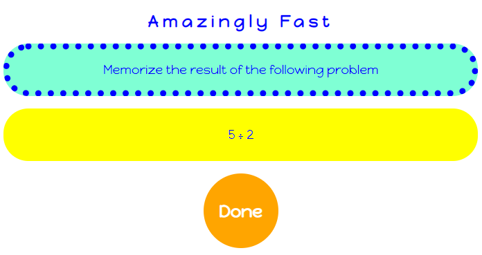
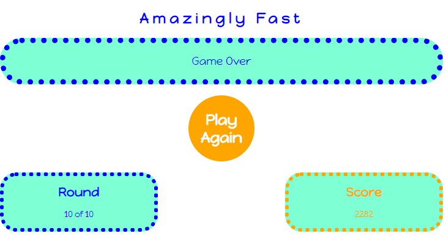

# Amazingly Fast

## User's Goal

The <em>Amazingly Fast</em> users want to play an online game to practice the four arithmetic operations and also exercise their short-term memory.

## Target Audience

<em>Amazingly Fast</em> is targeted to children from 9 to 12 years old although adults are likely to enjoy it too.

## Owner's Goal

The goal of <em>Amazingly Fast</em> is to bring fun to people while improving their arithmetic and memorization skills. 

In each round, the users will need to solve an arithmetic problem, as quickly as possible. They will also need to memorize the previous result, to compare it with the result of the current problem. So it is a mix of arithmetic, memorization and luck. The owner hopes that this mix will bring fun to the users.

## Features 

### Existing Features

- The starting screen

This is the first screen with an animation that makes the title and the button change color passing through several colors for 2 seconds.

The user can continue by clicking the Yes button.

- First instruction to the user

A first instruction is presented, asking the user to memorize a random problem.

The user can continue by clicking the Done button.

- The question each round and the score rules

At each round the user needs to mentally solve a problem and compare the result with the previous one.

A correct answer scores from 10 to 1000 points, depending on how faster it is given.
  
10 point means the user tooks about 10 seconds or more to answer correctly.

1000 points means the correct answer was given in 100 miliseconds or less.

- The message to the users when they answer correctly but not amazingly fast

The intention here is to say "Yes, Nice" and inform how many points the user earned this round for this correct answer.

- The message to the users when they answer correctly and amazingly fast

The intention here is to say "Great! Well done!" and inform how many points the user earned this round for this amazingly fast and correct answer.

- The message to the users when they answer incorrectly

The intention here is to encourage the user to do better next time

- The Game Over / Play Again screen

Here the users can check their final score that is blinking in the right-bottom corner of the page and they can also click Play Again to start a new game.

### Future Features

In a future release it is possible and expected that the following features will be implemented:

<ul>
<li>
  
Ability to define the number of rounds.

  
Currently there are 10 rounds pre-defined and the user cannot change this.

</li>
<li>
  
Ability to define the range of numbers to use as operands.

  
Currently this range is defined as "integers from 1 to 10" and the user cannot change this.

</li>
<li>
  
Ability to define which operations are allowed.

  
Currently the four arithmethic operations are used.

  
For example if the user wants to practice only addition and subtraction, this future feature will help.

</li>
</ul>

## Testing 

### Different Devices

The test approach consisted of validating on different browsers and devices, navigating, scrolling when possible, clicking in every link, changing the size of the viewport and trying to reproduce every scenario a user might come across. This to ensure that the website is working and looking good in all situations.

### <em>Am I Responsive</em> website
For a summarized view of the game in different devices and in order not to tire readers of this document, please check below the tests that were also performed by playing the game in each screen inside the <em>Am I Responsive</em> web site.

  
  
  
  
  
  
  

### Validator Testing

- HTML
  - No errors were returned when passing the URI of the html page through the official [W3C Validator](https://validator.w3.org/):
    - https://validator.w3.org/nu/?showsource=yes&doc=https%3A%2F%2Fjmarcosdias.github.io%2Famazing%2Findex.html
- CSS
  - No errors were found when passing the URI of the styles.css file through the official [(Jigsaw) Validator](https://jigsaw.w3.org/css-validator/):
    - https://jigsaw.w3.org/css-validator/validator?uri=https%3A%2F%2Fjmarcosdias.github.io%2Famazing%2Findex.html&profile=css3svg&usermedium=all&warning=1&vextwarning=&lang=en
- JavaScript
  - No errors were found when passing the final code in script.js through the Jshint linter [(Jshint) Linter](https://jshint.com/).
  - The use of the Jshint helped with simplification of the code and also helped with the identification of small bugs like some missing semicolons, that were then fixed.

### Unfixed Bugs

The dev-testing strategy consisted in developing parts of the game, testing, fixing or improving any findings before continuing with the development.

This way at the end there were no bugs to fix.

## Deployment

The website was deployed to GitHub pages. The steps to deploy are as follows. 

In the GitHub repository:
  - Navigate to the Settings tab 
  - Click on the Pages link on the bottom of the left menu
  - Go to the source section drop-down menu
  - Select the main branch 
  - Save this change

The live link for the <em>Amazingly Fast</em> math game can be found [here](https://jmarcosdias.github.io/amazing/).

 

