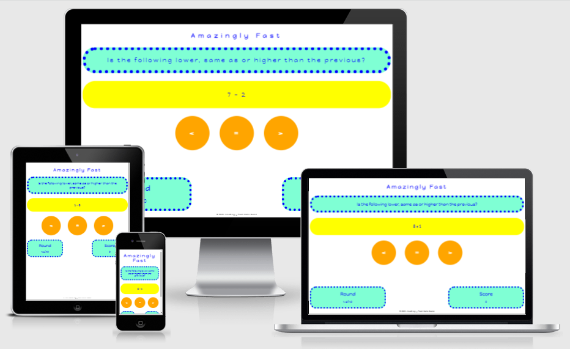

# Amazingly Fast

## User's Goal

The <em>Amazingly Fast</em> users want to play an online game to practice the four arithmetic operations and also exercise their short-term memory.

## Target Audience

<em>Amazingly Fast</em> is targeted to children from 9 to 12 years old although adults are likely to enjoy it too.

## Owner's Goal

The goal of <em>Amazingly Fast</em> is to bring fun to people while improving their arithmetic and memorization skills. 

In each round, the users will need to solve an arithmetic problem, as quickly as possible. They will also need to memorize the previous result, to compare it with the result of the current problem. So it is a mix of arithmetic, memorization and luck. The owner hopes that this mix will bring fun to the users.

## Features 

### Existing Features

- The starting screen

This is the first screen presented with a CSS animation making the title and the Yes button change color several times for 2 seconds. 

The user can continue by clicking the Yes button.

- First instruction to the user

A first instruction is presented, asking the user to memorize a random problem. 

The user can continue by clicking the Done button.

### Future Features

In a future release it is possible and expected that the following features will be implemented:

<ul>
<li>
  
Ability to define the number of rounds.

  
Currently there are 10 rounds pre-defined and the user cannot change this.

</li>
<li>
  
Ability to define the range of numbers to use as operands.

  
Currently this range is defined as "integers from 1 to 10" and the user cannot change this.

</li>
<li>
  
Ability to define which operations are allowed.

  
Currently the four arithmethic operations are used.

  
For example if the user wants to practice only addition and subtraction, this future feature will help.

</li>
</ul>

 

